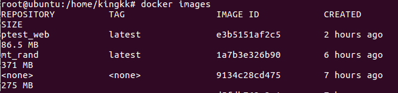
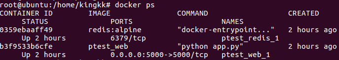

# 前言

上学期寒假开始就稍微了解了下docker，无奈用的不是很多，也不是很懂

后来被强制性要求使用了几次docker（不得不说，安装配置问题一直令我很头大），就也算勉强能起来一个服务了

用了几次之后就决定系统的总结一下docker的使用，因为只是一些总结，更多的只是针对于我个人用的，不官方，不权威，不系统

# Docker的三大概念

## 镜像（Images）

> Docker 镜像是一个特殊的文件系统，除了提供容器运行时所需的程序、库、资源、配置等文件外，还包含了一些为运行时准备的一些配置参数（如匿名卷、环境变量、用户等）。镜像不包含任何动态数据，其内容在构建之后也不会被改变。 

可以通过`docker ps` 来查看本机当中的镜像



## 容器（Container ）

`容器`和`镜像`的关系类似于`实例`与`类`之间的关系

一个镜像可以起多个容器，并指定不同的参数

可以通过`docker ps`查看当前运行的容器



## 仓库（Repository ）

概念类似于git的仓库，我们可以从docker官方的仓库dockerhub中获取我们想要的镜像

利用`<仓库名>:<标签> `的形式来获取指定仓库中的镜像，例如`ubuntu:16.04 `获取16.04版本的ubuntu

也可以将自己做好的镜像push到个人仓库中，供大家使用

# Dockerfile

构建一个镜像一般使用Dockerfile来定制

类似于写入一个docker的配置文件，就可以根据配置的文件来生产特质的docker镜像

## 样例

下面是一个dockerfile的样例

```dockerfile
# 第一行写跟第1点中一样的基本镜像
FROM ubuntu:14.04
# 这里可以写上你的姓名/昵称
MAINTAINER yourname
# 这里可以写上你的制作时间
ENV REFRESHED_AT 2018-01-01
# 使用utf-8编码
ENV LANG C.UTF-8

# 先写 修改源/更新 【如果必须的话】
# 替换源（这里可用sed或者直接COPY一个完整的sources.list来替换）
RUN sed -i 's/http:\/\/archive.ubuntu.com\/ubuntu\//http:\/\/mirrors.163.com\/ubuntu\//g' /etc/apt/sources.list
# 进行更新
RUN apt-get update -y
# 将环境变量设置为非交互的 【这个看个人】
ENV DEBIAN_FRONTEND noninteractive

# 再写 各种安装
# 如 安装mysql
RUN apt-get -y install mysql-server
# 安装apache2
RUN apt-get -yqq install apache2
# 安装php5
RUN apt-get -yqq install php5 libapache2-mod-php5
# 安装php扩展
RUN apt-get install -yqq php5-mysql php5-curl php5-gd php5-intl php-pear php5-imagick php5-imap php5-mcrypt php5-memcache php5-ming php5-ps php5-pspell php5-recode php5-snmp php5-sqlite php5-tidy php5-xmlrpc php5-xsl

# 再 修改一些配置
# 对于文件中的替换字符串，多使用sed命令
# 例如去掉apache2的列目录漏洞
RUN sed -i 's/Options Indexes FollowSymLinks/Options None/' /etc/apache2/apache2.conf

# 然后才是复制文件，不推荐挂载卷
# ADD会自动解压压缩包，而COPY不会
ADD html.tgz /var/www

# 剩下一些操作（权限要控制好）
# 例如修改某个文件的所有者
RUN chown root:root /var/www/html/x.php

# start.sh为开机启动脚本，里面包含容器开启后要启动的命令
COPY start.sh /root/start.sh
# 加上执行权限
RUN chmod +x /root/start.sh
# 使用ENTRYPOINT而不使用CMD（CMD容易受run命令最后的命令给影响）
ENTRYPOINT cd /root; ./start.sh
# WEB开放端口默认为80，一般为一个，若有特殊情况，请写明
EXPOSE 80
```

里面注释也给的很清楚，就不做画蛇添足的解释了，然后来具体解释下一些命令

## 一些前置知识

### docker commit

dockerfile中的每一条命令都会创建新的一层，然后执行命令，最后执行一次`docker commit`保存这一层的修改，构成新的一层镜像。后面层的镜像都是在前一层的基础上进行改动

例如如下命令就会创建三层docker镜像，这样没有什么意义，并且浪费资源。而且最大的层数是有限制的

```dockerfile
RUN apt-get install -y php5-mysql 
RUN apt-get install -y php5-curl 
RUN apt-get install -y php5-gd
```

正确的写法应该将改动合并到一条命令中

```dockerfile
RUN apt-get install -y php5-mysql php5-curl php5-gd
```


还有一种情况就是我们想运行/var/www/html下的install.php文件

```dockerfile
RUN cd /var/www/html
RUN php install.php
```

会发现其实根本没有运行这一条执行，因为新建的一层镜像执行目录又回归到了home目录中，所以前一个`cd`命令可以说是无效的

正确的写法

```dockerfile
RUN cd /var/www/html && php install.php
```

### 容器就是进程 

这里先简单介绍一下CMD命令，其是用于启动容器时执行一些命令，一个dockerfile中只能有一个CMD命令，其用法如下

```
shell 格式：CMD <命令>
exec 格式：CMD ["可执行文件", "参数1", "参数2"...]
```

如

```dockerfile
CMD echo "hello world!"
CMD ["echo","hello word!"] # 注意要用双引号
```

如果是用第一种，也就是shell格式时，在实际的执行过程中，会变成如下命令

```dockerfile
CMD ["sh","-c","echo hello world!"]
```


然后就是docker中比较重要的两个概念

> Docker 不是虚拟机，容器中的应用都应该以前台执行，而不是像虚拟机、物理机里面那样，用 upstart/systemd 去启动后台服务，容器内没有后台服务的概念。 

> 对于容器而言，其启动程序就是容器应用进程，容器就是为了主进程而存在的，主进程退出，容器就失去了存在的意义，从而退出，其它辅助进程不是它需要关心的东西。 

比如之前我将CMD命令写为

```dockerfile
CMD service apache2 start
```

可是真正运行的时候就会发现刚运行起来，容器就结束了

这就是因为在真正执行的时候这条命令被解释成了`CMD ["sh","-c","service apache2 start"]`

实际上的主进程是`sh`，当`service apache2 start`命令结束之后，`sh`也就结束了。整个docker容器也跟随主进程的结束而一同结束了

写成如下格式即可

```dockerfile
CMD ["/usr/sbin/apache2ctl", "-D", "FOREGROUND"]
```


## 命令

主要介绍几个常用的，更详细的可以见官方文档

### FROM

指定基础镜像。想要定制一个镜像就需要以另一个镜像为基础

docker官方提供了相当多的基础镜像，ubuntu、centos、debian，各种版本都有

以ubuntu16.04为基础镜像

```dockerfile
FROM ubuntu:16.04
```

### RUN

用于执行命令，一般有如下两种格式

```dockerfile
shell 格式：RUN <命令>
exec 格式 ：RUN ["可执行文件", "参数1", "参数2"...]
```

### CMD

前面介绍过，格式和RUN一样，用于容器的启动命令

由于有时启动时需要执行较多的命令，而又只能执行一次CMD命令。一种较为通用的解决方法就是将命令写入start.sh中，CMD只要执行start.sh即可

### COPY

复制文件，将本地的文件复制到docker镜像中

```dockerfile
COPY www /var/www/html
```

将本目录下www文件夹放到/var/www/html中

### ADD

更为高级的复制命令

若是压缩包会进行解压后进行复制，若是url则会去下载这个链接的文件后进行复制

格式和COPY一样

```dockerfile
ADD html.tgz /var/www
```

### ENV

用于设置环境变量

```dockerfile
ENV <key> <value>
ENV <key1>=<value1> <key2>=<value2>...
```

个人习惯于设置成非交互模式的

```dockerfile
ENV DEBIAN_FRONTEND noninteractive
```

### WORKDIR

指定工作目录，意为所执行的命令都是在当前目录下执行的

将工作目录切换到www目录下

```dockerfile
WORKDIR /var/www/html
```

### EXPOSE

声明端口，相当于当前容器暴露出这几个端口

```dockerfile
EXPOSE <端口1> [<端口2>...]
```

一般作为web服务器会暴露80端口

```dockerfile
EXPOSE 80
```

# 容器操作

## 启动容器

主要是`docker run`命令，然后添加一些执行的参数

### 直接运行

```
docker run <镜像名> <命令>
```
这样就能指定镜像运行，并且在运行时指定命令（会覆盖CMD命令）

```
root@ubuntu:/home/kingkk# docker run ubuntu:16.04 echo "hello world!"
hello world!
```

当程序运行结束后，容器也会随之退出

### 进入终端

```
docker run -it <镜像名> bash
```

运行一个容器，并进入其bash终端

```
root@ubuntu:/home/kingkk# docker run -it ubuntu:16.04 bash
root@a580f7a50a57:/# 
```

### 后台运行

更多时候使用docker是为了起一个服务，如web服务，我们更希望他在后台运行

```
docker run -d -p 本机端口:容器端口 <镜像名>
```

这也就可以在后台运行一个容器，`-d`为在后台运行，`-p`表示端口映射

不过要确保主进程一直在运行，否则会因为主进程的退出，容器也会退出

可以通过`docker ps`查看正在运行的容器，及其一些信息


### 进入容器

```dockerfile
docker exec -it <容器ID> /bin/bash
```

这样就可以进入正在运行的容器当中

```
root@ubuntu:/home/kingkk# docker exec -it 7eb8 /bin/bash
root@7eb822f6277f:/# ls
bin   dev  lib    media  opt   root  sbin  sys  usr  boot
etc  home  lib64  mnt    proc  run   srv   tmp  var
```


## 终止容器

终止就比较简单了

```
docker stop <容器ID>
```
这样就终止了一个正在运行的容器，终止成功并返回容器ID
```
root@ubuntu:/home/kingkk# docker stop 7eb8
7eb8
```


# 一个完整的示例

首先根据之前的样例中的Dockerfile写出一个完整的lamp的系统

- ubuntu 16.04
- php 7.0.30
- mysql 5.7.23
- apache2

建立了个docker目录，目录结构如下

```dockerfile
root@ubuntu:/home/kingkk/docker/test# tree ./
./
├── Dockerfile
├── start.sh
└── www
    └── index.php
```

文件内容如下

Dockderfile

```dockerfile
FROM ubuntu:16.04

MAINTAINER kingkk

ENV REFRESHED_AT 2018-08-09

ENV LANG C.UTF-8

RUN sed -i 's/http:\/\/archive.ubuntu.com\/ubuntu\//http:\/\/mirrors.163.com\/ubuntu\//g' /etc/apt/sources.list

RUN apt-get update -y

ENV DEBIAN_FRONTEND noninteractive

RUN apt-get -y install mysql-server

RUN apt-get -yqq install apache2

RUN apt-get -yqq install php libapache2-mod-php

RUN apt-get install -yqq php-mysql php-curl php-gd php-intl php-pear php-imagick php-imap php-mcrypt php-memcache php-pspell php-recode php-snmp php-tidy php-xmlrpc php-xsl

RUN echo "ServerName localhost:80" >> /etc/apache2/apache2.conf

RUN rm -rf /var/www/html/index.html

RUN sed -i 's/Options Indexes FollowSymLinks/Options None/' /etc/apache2/apache2.conf

ADD ./www /var/www/html

COPY start.sh /root/start.sh

RUN chmod +x /root/start.sh

ENTRYPOINT cd /root; ./start.sh

EXPOSE 80

```

 start.sh

```dockerfile
#!/bin/bash
sleep 1

find /var/lib/mysql -type f -exec touch {} \; && service mysql start

mysqladmin -u root password "kingkk"
mysql -uroot -pkingkk -e "CREATE DATABASE IF NOT EXISTS kingkk"

/usr/sbin/apache2ctl -D FOREGROUND
```

index.php

```php
<?php
$servername = "localhost";
$username = "root";
$password = "kingkk";
 
$conn = new mysqli($servername, $username, $password);
 
if ($conn->connect_error) {
    die("连接失败: " . $conn->connect_error);
} 
phpinfo();
```


然后在当前目录生成test镜像

```
docker build -t test .
```

等待运行结束后`docker images`即可查看到新生成的镜像


运行test镜像

```
docker run -d -p 8888:80 test
```

`docker ps `就能查看到正在运行的容器状态


访问一下


OK 运行成功

# 一些常见问题

有时候启动不了可能还需要安装`sudo apt-get install docker.io`


会涉及到很多权限问题，需要切换成root权限来执行。无法获得root权限就要将用户添加到docker用户组


容器名和镜像名都可以用哈希值（或者哈希的一部分）代替


使用过windows和linux上的docker，windows上会出现一些小问题，如`\r\n`和`\n`,而且和虚拟机啊不能共存。所以推荐在linux上用docker。（mac没钱买不起。。。


可以更新下docker源，会提示很多速度


在测试部署的时候可以使用-v参数

````
docker run -d -p 80:80 -v ./www:/var/www/html/  imagename
````

相当于将当前目录下www目录和容器中/var/www/html/目录相关联，当你本地文件发生变化时，容器中的文件也会随之变化


有时候会多出很多\<none\>镜像，这种镜像被称为悬空镜像，可以用`docker image prune`删除

# Reference Link

https://yeasy.gitbooks.io/docker_practice