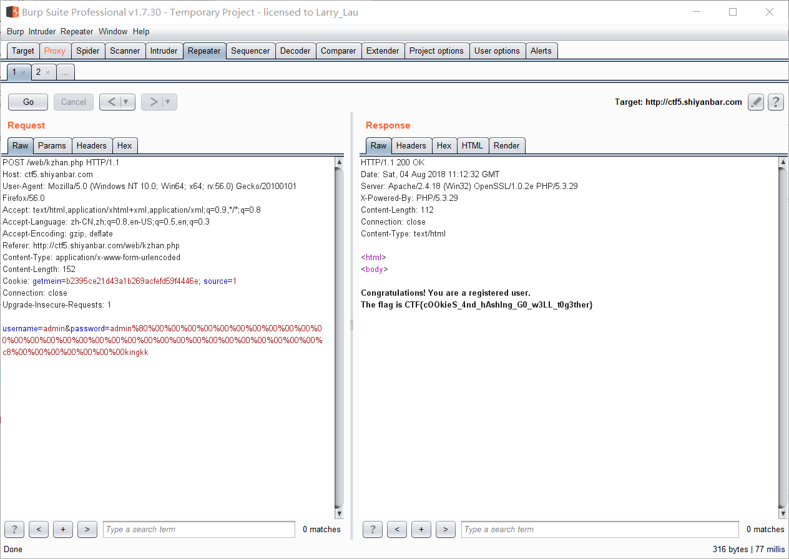

# 前言
本来这个哈希长度扩展攻击应该在一年前刷实验吧的时候就应该解决的。  
但是由于那时候实在看不懂，再加上有点偷懒，就把这部分给跳了  
时隔一年，在学习中偶尔有碰到这个（虽然不是很多），感觉没有想象中那么鸡肋，就决定重新捡起来学习一下  

不过，就算过了一年，发现依旧是那么菜，看了一整天的分析博客，才勉强理清逻辑  

# 攻击的用途和原理
## 用途
感觉这个还是很重要的，更多时候需要知道的是怎么用，在什么环境下才能利用这种漏洞  

```
在 $hash = md5($secret.$key) 中已知 $hash 和 $key 以及 $secret 的长度时  
可以找到另一个 $_hash 和 $_key 使得 $_hash = md5($secrect.$_key) 成立  
```

## 原理
网上有很多，也很清楚的分析了md5加密的过程，我这里就不赘述  
贴几个感觉比较好的博客  
http://seaii-blog.com/index.php/2017/05/12/56.html  
http://archimesan.me/2017/12/23/hash长度扩展攻击/  
http://blog.chinaunix.net/uid-27070210-id-3255947.html  

具体的payload构造过程下面通过一个ctf的题目来引入

# 实验吧中的ctf题
代码如下
```php
$flag = "XXXXXXXXXXXXXXXXXXXXXXX";
$secret = "XXXXXXXXXXXXXXX"; // This secret is 15 characters long for security!

$username = $_POST["username"];
$password = $_POST["password"];

if (!empty($_COOKIE["getmein"])) {
    if (urldecode($username) === "admin" && urldecode($password) != "admin") {
        if ($COOKIE["getmein"] === md5($secret . urldecode($username . $password))) {
            echo "Congratulations! You are a registered user.\n";
            die ("The flag is ". $flag);
        }
        else {
            die ("Your cookies don't match up! STOP HACKING THIS SITE.");
        }
    }
    else {
        die ("You are not an admin! LEAVE.");
    }
}

setcookie("sample-hash", md5($secret . urldecode("admin" . "admin")), time() + (60 * 60 * 24 * 7));

if (empty($_COOKIE["source"])) {
    setcookie("source", 0, time() + (60 * 60 * 24 * 7));
}
else {
    if ($_COOKIE["source"] != 0) {
        echo ""; // This source code is outputted here
    }
}
```
题目的大意为：  
已知 `md5($secret . urldecode("admin" . "admin"))`  
在不知道$secret的情况下，获取到另外一个`md5($secret . urldecode("admin" . $password))`的哈希值  

正好满足哈希长度扩展攻击的要求，并且也给了`$secret`的长度为15  

构造payload的方式如下：  
在一开始的`md5($secret."admin"."admin")`中，一共有25个字节，转化成比特就是200个比特长度  
通过padding之后变成了
```
admin%80%00%00%00%00%00%00%00%00%00%00%00%00%00%00%00%00%00%00%00%00%00%00%00%00%00%00%00%00%00%00%c8%00%00%00%00%00%00%00
```
`%80`为结束符,`%c8`是数据长度，也就是200的十六进制表示。利用%00补充完56个字节，然后剩下的8个字节用来表示数据长度  

这样计算完之后的md5值也可以从`$_COOKIE`中获取也就是`571580b26c65f306376d4f64e53cb5c7`  
通过高低位互换之后的链变量为  
```
s1=0xb2801557
s2=0x06f3656c
s3=0x644f6d37
s4=0xc7b53ce5
```
上一轮的链变量将给下一轮使用  
这样就可以在后面添加任意数据，在已知上一轮的链变量之后，就可以推导出下一轮加密后的结果  

这里从github中拿来的一个md5python实现（在学习的时候实在不是很喜欢用HashPump这些工具，还是看代码实在点）  
```python
# -*- coding: utf-8 -*-
# @Author: King kaki
# @Date:   2018-08-04 12:40:11
# @Last Modified by:   King kaki
# @Last Modified time: 2018-08-04 19:07:27
import math


F = lambda x, y, z: ((x & y) | ((~x) & z))
G = lambda x, y, z: ((x & z) | (y & (~z)))
H = lambda x, y, z: (x ^ y ^ z)
I = lambda x, y, z: (y ^ (x | (~z)))
L = lambda x, n: (((x << n) | (x >> (32 - n))) & (0xffffffff))
shi_1 = (7, 12, 17, 22) * 4
shi_2 = (5, 9, 14, 20) * 4
shi_3 = (4, 11, 16, 23) * 4
shi_4 = (6, 10, 15, 21) * 4
m_1 = (0, 1, 2, 3, 4, 5, 6, 7, 8, 9, 10, 11, 12, 13, 14, 15)
m_2 = (1, 6, 11, 0, 5, 10, 15, 4, 9, 14, 3, 8, 13, 2, 7, 12)
m_3 = (5, 8, 11, 14, 1, 4, 7, 10, 13, 0, 3, 6, 9, 12, 15, 2)
m_4 = (0, 7, 14, 5, 12, 3, 10, 1, 8, 15, 6, 13, 4, 11, 2, 9)


def T(i):
	return (int(4294967296 * abs(math.sin(i)))) & 0xffffffff


def shift(shift_list):
	shift_list = [shift_list[3], shift_list[0], shift_list[1], shift_list[2]]
	return shift_list


def fun(fun_list, f, m, shi):
	count = 0
	global Ti_count
	while count < 16:
		xx = int(fun_list[0], 16) + f(int(fun_list[1], 16), int(fun_list[2], 16), int(fun_list[3], 16)) + int(m[count], 16) + T(Ti_count)
		xx &= 0xffffffff
		ll = L(xx, shi[count])
		fun_list[0] = hex((int(fun_list[1], 16) + ll) & 0xffffffff)
		fun_list = shift(fun_list)
		count += 1
		Ti_count += 1
	return fun_list


def gen_m16(order, ascii_list, f_offset):
	ii = 0
	m16 = [0] * 16
	f_offset *= 64
	for i in order:
		i *= 4
		m16[ii] = '0x' + ''.join((ascii_list[i + f_offset] + ascii_list[i + 1 + f_offset] + ascii_list[i + 2 + f_offset] + ascii_list[i + 3 + f_offset]).split('0x'))
		ii += 1
	for ind in range(len(m16)):
		m16[ind] = reverse_hex(m16[ind])
	return m16


def reverse_hex(hex_str):
	hex_str = hex_str[2:]
	if len(hex_str) < 8:
		hex_str = '0' * (8 - len(hex_str)) + hex_str
	hex_str_list = []
	for i in range(0, len(hex_str), 2):
		hex_str_list.append(hex_str[i:i + 2])
	hex_str_list.reverse()
	hex_str_result = '0x' + ''.join(hex_str_list)
	return hex_str_result


def show_result(f_list):
	result = ''
	f_list1 = [0] * 4
	for i in f_list:
		f_list1[f_list.index(i)] = reverse_hex(i)[2:]
		result += f_list1[f_list.index(i)]
	return result


def padding(input_m, msg_lenth=0):
	ascii_list = list(map(hex, map(ord, input_m)))
	msg_lenth += len(ascii_list) * 8
	ascii_list.append('0x80')
	for i in range(len(ascii_list)):
		if len(ascii_list[i]) < 4:
			ascii_list[i] = '0x' + '0' + ascii_list[i][2:]
	while (len(ascii_list) * 8 + 64) % 512 != 0:
		ascii_list.append('0x00')
	msg_lenth_0x = hex(msg_lenth)[2:]
	msg_lenth_0x = '0x' + msg_lenth_0x.rjust(16, '0')
	msg_lenth_0x_big_order = reverse_hex(msg_lenth_0x)[2:]
	msg_lenth_0x_list = []
	for i in range(0, len(msg_lenth_0x_big_order), 2):
		msg_lenth_0x_list.append('0x' + msg_lenth_0x_big_order[i: i + 2])
	ascii_list.extend(msg_lenth_0x_list)
	return ascii_list


def md5(input_m):
	global Ti_count
	Ti_count = 1
	abcd_list = ['0x67452301', '0xefcdab89', '0x98badcfe', '0x10325476']
	ascii_list = padding(input_m)
	for i in range(0, len(ascii_list) // 64):
		aa, bb, cc, dd = abcd_list
		order_1 = gen_m16(m_1, ascii_list, i)
		order_2 = gen_m16(m_2, ascii_list, i)
		order_3 = gen_m16(m_3, ascii_list, i)
		order_4 = gen_m16(m_4, ascii_list, i)
		abcd_list = fun(abcd_list, F, order_1, shi_1)
		abcd_list = fun(abcd_list, G, order_2, shi_2)
		abcd_list = fun(abcd_list, H, order_3, shi_3)
		abcd_list = fun(abcd_list, I, order_4, shi_4)
		output_a = hex((int(abcd_list[0], 16) + int(aa, 16)) & 0xffffffff)
		output_b = hex((int(abcd_list[1], 16) + int(bb, 16)) & 0xffffffff)
		output_c = hex((int(abcd_list[2], 16) + int(cc, 16)) & 0xffffffff)
		output_d = hex((int(abcd_list[3], 16) + int(dd, 16)) & 0xffffffff)
		abcd_list = [output_a, output_b, output_c, output_d]
		Ti_count = 1
		print(ascii_list)
	return show_result(abcd_list)


# md5-Length Extension Attack: 计算 md5(message + padding + suffix), res = md5(message), len_m = len(message)
def md5_lea(suffix, res, len_m):
	global Ti_count
	Ti_count = 1
	abcd_list = []
	for i in range(0, 32, 8):
		abcd_list.append(reverse_hex('0x' + res[i: i + 8]))
	ascii_list = padding(suffix, (len_m + 72) // 64 * 64 * 8)  # len(message + padding) * 8
	for i in range(0, len(ascii_list) // 64):
		aa, bb, cc, dd = abcd_list
		order_1 = gen_m16(m_1, ascii_list, i)
		order_2 = gen_m16(m_2, ascii_list, i)
		order_3 = gen_m16(m_3, ascii_list, i)
		order_4 = gen_m16(m_4, ascii_list, i)
		abcd_list = fun(abcd_list, F, order_1, shi_1)
		abcd_list = fun(abcd_list, G, order_2, shi_2)
		abcd_list = fun(abcd_list, H, order_3, shi_3)
		abcd_list = fun(abcd_list, I, order_4, shi_4)
		output_a = hex((int(abcd_list[0], 16) + int(aa, 16)) & 0xffffffff)
		output_b = hex((int(abcd_list[1], 16) + int(bb, 16)) & 0xffffffff)
		output_c = hex((int(abcd_list[2], 16) + int(cc, 16)) & 0xffffffff)
		output_d = hex((int(abcd_list[3], 16) + int(dd, 16)) & 0xffffffff)
		abcd_list = [output_a, output_b, output_c, output_d]
		Ti_count = 1
	# print(ascii_list)
	return show_result(abcd_list)


if __name__ == '__main__':
	print(md5_lea('kingkk','571580b26c65f306376d4f64e53cb5c7',15))

```
可以求出`$sercet.admin%80%00%00%00%00%00%00%00%00%00%00%00%00%00%00%00%00%00%00%00%00%00%00%00%00%00%00%00%00%00%00%c8%00%00%00%00%00%00%00kingkk`  
的md5值为`b2395ce21d43a1b269acfefd59f4446e`
  
成功获得flag  
主要就是利用了将上一轮的链变量给下一轮使用，使得可以在末尾添加数据，获得相应的md5值，而不需要知道前面具体的值  

# 自动化利用工具
自己写了个自动化生成payload的脚本https://github.com/kingkaki/Exploit-scripts/blob/master/hash-length-extension/hash-extension.py  
能自动遍历出前缀1-30的payload,这里前面一共有25个值，所以取25生成的payload即可  
想便利更多值的修改下for循环即可

  
